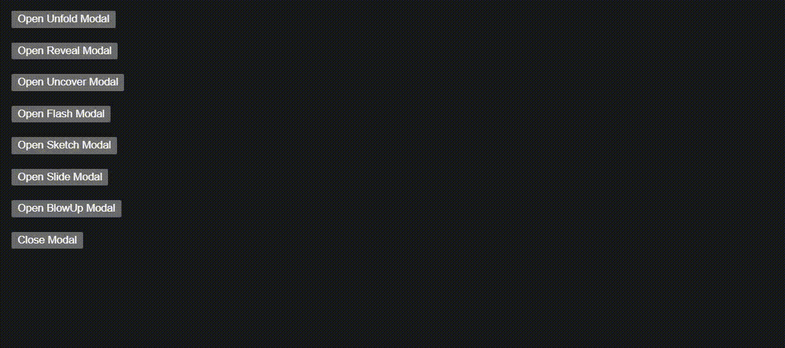

<div align="center">

<h1>React Animated Modal</h1>
</div>

<!-- Repository stats -->

<div align="center">


<h3>React component library for modals with animation.</h3>

</div>

> This component library is inspired from [Jesse Couch](https://codepen.io/designcouch)'s [Animated Modal](https://codepen.io/designcouch/pen/obvKxm) codepen.

<!-- Demo -->

## Demo



<!-- Installation -->

## Installation

### yarn

```bash
yarn add @dorbus/react-animated-modal
```

### npm

```bash
npm install @dorbus/react-animated-modal
```

<!-- Usage -->
## Usage

To use Animated Modal in your application, first import  `AnimatedModal`, `AnimatedModalObject`, `ModalAnimation` and `AnimatedModalFrame`.

### Ref

Create a Ref object using `useRef` and pass it to the `AnimatedModal` Component.

```typescript
const ref = useRef<AnimatedModalObject>(null);

<AnimatedModal ref={ref} />
```

### Modal Animations

For now, the library supports seven different animations:

- Unfold: `ModalAnimation.Unfold`
- Reveal: `ModalAnimation.Reveal`
- Uncover: `ModalAnimation.Uncover`
- Flash: `ModalAnimation.Flash`
- Slide: `ModalAnimation.Slide`
- BlowUp: `ModalAnimation.BlowUp`
- Sketch: `ModalAnimation.Sketch`

## Using Animations

Use animation prop to enable different animations, by default the animation is of type Unfold.

```typescript
<AnimatedModal
    ref={ref}
    animation={ModalAnimation.Unfold}/>
```

## API

<table>
    <thead>
        <tr>
            <th>Component</th>
            <th>Prop</th>
            <th>Type</th>
            <th>Description</th>
            <th>Default</th>
        </tr>
    </thead>
    <tbody>
        <tr>
            <td rowspan=10>AnimatedModal</td>
            <td>startOpen</td>
            <td><code>boolean</code></td>
            <td>State open state of the modal in start</td>
            <td><code>false</code></td>
        </tr>
        <tr>
            <td>animation</td>
            <td><code>ModalAnimation</code></td>
            <td>Different modal animations</td>
            <td><code>ModalAnimation.Unfold</code></td>
        </tr>
        <tr>
            <td>closeOnBackgroundClick</td>
            <td><code>boolean</code></td>
            <td>Whether the modal should close on background click</td>
            <td><code>true</code></td>
        </tr>
        <tr>
            <td>backgroundStyle</td>
            <td><code>CSS</code></td>
            <td>Pass custom background styles</td>
            <td>-</td>
        </tr>
        <tr>
            <td>modalStyle</td>
            <td><code>CSS</code></td>
            <td>Pass custom modal styles</td>
            <td>-</td>
        </tr>
    </tbody>
</table>

## Project Created & Maintained By

### Divyanshu Shekhar

<a href="https://twitter.com/dshekhar17"></a> <a href="https://in.linkedin.com/in/divyanshu-shekhar-a8a04a162"></a> <a href="https://instagram.com/dshekhar17"></a>

[](https://github.com/divshekhar/)

### Aniket Pathak

<a href="https://www.linkedin.com/in/aniket-pathak-8925311b5/"></a> <a href="https://www.instagram.com/anik3t_pathak/"></a>

[](https://github.com/aniketpathak028/)

## Stargazers

[](https://github.com/dorbus/react-animated-modal/stargazers)

## Forkers

[](https://github.com/dorbus/react-animated-modal/network/members)

<!-- License -->
## Copyright & License

Code and documentation Copyright (c) [ISC](LICENSE) © 2022 Dorbus.
